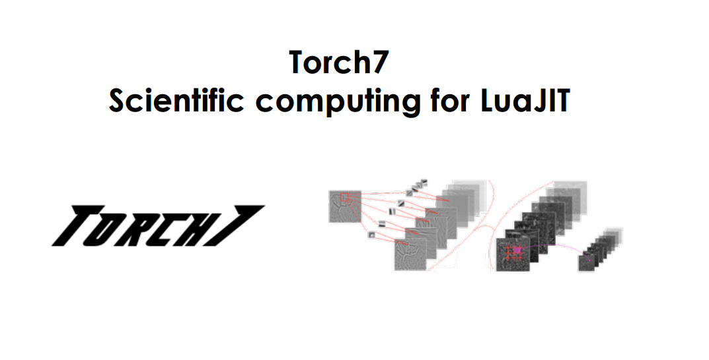

# Algoritmo neuronal de estilos artisticos

## Descripción del Trabajo
El presente trabajo se enfoca en la implementación de un algoritmo que permita la creación de imágenes artísticas de alta calidad perceptiva mediante el uso de redes neuronales profundas.

## Introducción
El ser humano ha logrado crear experiencias visuales a través del arte mediante algoritmos que han resultado un misterio por mucho tiempo. El aprendizaje profundo representa un camino para el entendimiento de este algoritmo, el uso de redes convolucionales.
En este trabajo mostramos que haciendo uso de las redes convolucionales podemos representaer el estilo y el contenido de manera separadas, así podemos generar imágenes mezclando el estilo y el contenido de dos imagenes diferentes.
## Motivo y Descarga de Responsabilidades
El contenido de una imagen y el estilo se pueden separar, así al queren combinar el contenido de una imagen con el estilo de otra no es posible encontrar una imagen que coincida completamente con ambas restricciones. Por ello para obtener imagenes visualmente atractivas podemos regular el énfasis en el contenido y estilo. Con un fuerte énfasis en el contenido se logra observar claramente la imagen pero no el estido de la otra imagen;y lo mismo ocurre al incrementar el énfasis en el contenido de la otra imagen.

##Estado del arte

#### 1. Krizhevsky, A., Sutskever, I. & Hinton, G. E.  Imagenet classification with deep convolutional neural networks

##### 1.1 Resumen

se entreno una gran deep convolutional network  to classify the 1.2 million high resoltion images.

gpu implementing of the convolutional
La red neuronal tiene 60 millones de parametros y 650 000 neuronas consiste en 5 capas convolucionales.

Para implementar el desempeño de reconocimiento de objetos podemos:
+ Recopilar un conjunto de datos más grande.
+ Aprender modelos más potentes
+ Usar tecnicas para prevenir el sobreajuste.

Para aprender mejor de objetos e un conjunto de millones de imagenes.
su capacidad puede ser controlada variando su depth and breadth.

** comparado con la redes neuronales predictivas standar con capas de tamaño simuliar, las CNN tienen menos conexiones y parámetros y sean más facil de entrenar mientras que su mejor problables es que el rendimiento sea ligeramente peor**

CNN son atractivas por su arquitectura local, pero ha sido muy costoso aplicar a imagenes de alta resolución.
La GPU's han resultados utiles junto con la implementación altamente optimizada de la convolución 2D, son lo suficientemente potentes para facilitar el entreanmietno de CNN's increiblemente grandes  y aquellas que tienen grandes conjuntos de datos como ImageNet que contiene suficientes ejemplos para entrenar modelos sin hacer uso de sobreajuste severo

Nuestra red final contine 5 convoluciones y 3 capas conectadas a esta profundida para ser importante, encontramos que eliminaod cualquier capa convolucional(cada uno de los cuales contiene 1% de los parametros del modelo) resulto inferior al final el tamaño de la red queda delimitado por la memoria disponibles en las GPU's actuales. A la red le toma 6 para entrenar 2 gpus gtx 580 de 3gb
##### 2. El conjunto de datos.
 ImageBet es un dataset que contien 15 millones de imagenes de alta resolucion etiqutadas que perteneces a 22.00 categorias.
 Las imagenes fueron recolectads de la web y fueron etiquetadas por etiquetas hmanas usnaod usando amazon's mechanical turk crowd-sourcing tool. Empezo en el 2010 como pare de pascal visual object challenge en total hay 1.2 million de imagenes 50,000 imagnes de validaciion y 150000 de testing.
ILSVRC 2010 es la unica version qde prueba que esta disponible, esta version se desarrollan experimentos.
En imageNet es costumbre informar 2 tasas de error top-1 y top-2 donde la tasa de error de top-5 es la fraccíon de iamgenes de prueba cuya etiqueta correcta no se encuentra entre las 5 etiquetas que el modelo considera más probable.
Imagenet consiste en iamgenes de resolucion variable , mientras que el sistema requiere de una dimension de entrada contasten ** pór lo tanto se debe bajar a una resolucion fijade 256x256. de esta manera se entrea a la red para valores RGB de pixeles.

##### 3 Arquitectura
contiene 8 capasa aprendidas
5 convolucionales y 3 completamente conectadas.

##### 3.1 ReLU Nonlinearity

en terminos de tiempo de entrenamiento con gradiente de descenso estas no lineales saturantes son más lentos que las no lienase no saturantes.
Rectificado de unidades lineales(ReLU).CNN profunda que trabaja con Relu entrena varias veces más rapido que sus con unidades tanh. resulta dificil conseguir resultados eficientes solo usando la neurona tradicional
No somos los primeros en considerar alternativas a los modelos de nueronas tradicionales en CNN
- No linealidad de f funciona bien con su tipo de constrante de normalizacion
Sin embargo, en este conjunto de datos la principal preocupación es evitar el sobreajuste porque el efecto observado es diferente al acelerado la habilidad de ajustarse a un conjunto de entrenamiento que informamos al usar ReLU Un aprendizaje es más rapido si tiene una gran influencia en el rendimiento de modelos grandes entrenados en grandes conjuntos de datos.

##### 3.2 Training en multiples GPU's
Las limitacione en memporia de gpu's limita el maximo de las redes que puede ser entrenado. 1.2 millones de ejemplos es demasiado para hacerla en una GPU's. se extendio el problema a 2 GPU's. las GPU estan especialmente adeacuada para la paralelización de GPU cruzada ya que pueden leer y escribir directamente en la memoria del otro sin pasar por la maquina host.
El esquema empleado ponde la mistad de los nucleos o neuronas encada GPU con una adicional: las GPU se comunican solo en ciera capas.
 esto significa que los nuclos de la capa 3 toman la entrada los mapas del kernel en la capa2 . sin embargo los nucleos de la capa en la capa4 toman entrada solos esos mapas de kernel en la capa3 que residen  la misma GPU.
 Elegir un patron de conectividad es un problema para la validacion cruzada pero nos permite ajusta la cantidad de computacion
 en este esquema se reduce top1 en 1.7 y top 5 1.2 en comparacion  a una red con la mitad de nuclos en cada capa convolucional

##### 3.3 Local response Normalization

Las relu tienen la propiedad que no querieren normalizacion de entradas para evitarlas de saturarla. Si al menos algunos ejemplos de entrenamiento producen una entrada positiva a una relu aprendera que pasa en esa neurona.
Sin embargo encontramos que el siguiente esquema de nroamlizacion local ayuda a la generalziación.
Se aplica esta normalización despues de aplicar el ReLU en ciertas capas.
Es una normalización de brillo  reduce la tasa de error top1 en un 1. y top en 1.2
CNN logro una tasa deerro de 13% sin noramlizacion y 11% con nromalizacion

##### 3.4 Overlapping Pooling

Las capas agrupadas en CNN resumen la salidad de los grupos vecinos de neuronas en mismo kernel del mapa.
tradicionalmente los vecinos por unidades adyacente de agrupaciones no se superponen.
Para ser más precisos, se puede pensar que una capa de agrupamiento consiste en una grilla de agrupamiento unidades serpadas por pixeles de separación
Generalmente observamos durante el entrenamiento que los modelos con superposicion son un mas dificil de sobre equilibrar.

##### 3.5 Overall Architecture

Ahora estamos listos para describir la arquitectura general de nuestra CNN. La red tiene 8 capas con pesos los 5 primeros son convolucionales y los 3 estan completamente conectado. La salida de la última capa totalmente conectada se alimenta a un softmax de 1000 vias que produce una distribución de sobre las 1000 etiquetas de calses . La red maximiza la regresion logistical multinomial objetivo, que es equivalente a maximizar el promedio de los caso de entrenamiento de probabiliad de registrode la etiqueta correcta bajo la distribución de predicción.
Los nucleos de las capas convolucionales 2 4 5 estan conectados a solos a esos mapas de nucleo en la capa anterior que residen en la misma GPU.
Los nucleos de la 3ra capa estan conectados a todos los mpas del nucleo en la 2da capa. Las neuronas en las capas completamente conectadas, estan conectadsa a todas las neuronas en las previas capas.
Las capas de normalizacionde respuesta siguen la primera y la 2da capa  convolucional capasa de acumulación maxima .siguen las capas convolucionales en la 5ta capa La ReLU la no linealidad se aplica a la salida de cada capa convolucional. **La ReLU la no linealidad se aplica a la salida de la cada capa convolucional y completamente** conectada.

La segunda capa convolucional toma con entrada las respuesta normalizada y agrupada de la primera capa convoluconal y la filtra con 256 nucleos de tamaño 5x5 x48
la 3,4 y 5 capa convolucionales estan conectadas entre si sin ninguna intervención agrupación o capas de normalización .
la tercera capa tiene 384 nucloes de tamaño 3x3x256 conectados a la salida(normalizadas, agrupadas) de la 2da capa convolucional. la cuarta capa convolucional tiene convolucional tiene 384 nucleos de tamaño 3x3x192 y la qitna 256 nucloes de tamaño 3x3x192. Las capas completamente conectadas tiene 4096 neuronas cada uno.

##### 4 Reducing overfitting
Nuestra arquitectura tiene 60 millones de parametros aunque las 1000 clases de ILSVRC haga que cara ejemplo imponga 10bits de restricción en la asignación de la image a etiquetar, esto resulta ser insuficiente para aprender tantos parametros sin un  sobreajuste considerable. 2 FORMA DE COMBARTIR EL SOBREAJUSTE-

###### 4.1 Data Augmentation
El metodo más común para reducir el sobreajuste es agradar los datos de artificialmente el conjunto de datos utiliza transformaciones que preservan la etiqueta.
empleamos 2 formas distintas de aumento de datos, los cuales permiten que las imágenes transformadas se produzcan a partir de la imagen orginal con muy poco calculo, por lo que las imagenes transformadas no necesita almacenar ene l disco. En la implementacion las imagenes transformadas se se generarn en python en la cpu mientras que el GPU entrena el lote anterior de imagenes. Entonces podemos decir que el aumento de datos es computacionalmente gratos.
La primera forma de aumento de datos consiste en generar traducciones de imágenes de imagenes y reflejos horizontales hacemos esto extrayendo 224x224 parches ( y sus reflejos horizontales) y la capacitación de nuestra red en estos parches extraidos esto incrementa el tamaño de nuestro conjunto de entrenamiento establecido en un factor de 2048 aunque los ejemplso de entrenamiento resultante son por supuesto altamente interdependientes.
Sin este esquema nuestra red sufre sobreajuste sustancia que tendria que obligarnos tener redes mucho más pequeña.
La segunda forma de aumento de datos consiste en alterar las intesidades de canales RGB en imagenes de entreamiento Especificamente realizacmos PCA en el conjutno de valores de pixeles RGB en el conjunto de entreamiento.

###### 4.2 Dropout
La combinación de las predicciones de muchos modelos diferentes es una forma exitosa de reducir los errores de la prueba pero parece ser demasiado costoso para las redes neuronales grandes  que llevan varios dias de entrenamiento.Sin embargo existe unaversion muy eficiente de combinacion de modelos.
la tecnica consiste de configurar a 0 la salidad de cada neurona oculta con probabilidad 0.5. Las neuronas son dropout(abandonadas) de manera que no contribuyen al pase hacia adelante y no participan en la propagacion.
Asi cada vez que se presenta una entra la red neuronal toma una arquitectura diferente pero todas estas arquietecturas comprarte . estas tecnica reduce las adaptaciones complejas de las neuronas.
ya que cada neurona no puede confirma en la presencai de otras neuronas se fuerza aprender caracteristicas más robustas sque son utilies en la conjunción de muchos subconjuntos aleatorios diferentes de las otras neuronas.usamos droup en las 2 primeras capas.

##### 5 Detail of learning
Entrenamos nuestros modelos con una gradiente de descenso estocástiocon un tamaño de lote de 128 ejemplos mometum0,9 y decaimiento de peso 0.0005
inicializamos los pesos de cada capa con una distribución gaussianda de media cero con una desviacion estandar de 0.01 inicializamos el sesgo de las neuronas en la capa 2 4 5 capas convoluconaeles con las constante
esta inicializacion acelera las primeras etapas de aprendizzaje al proporcionar el ReLU  inicializamos las neuronas sesgos con las capas restantats a 0
.

##### Discusiones
Nuestro resultados muestra  es capaz de logra buenos resultados en un conjunto de datos altamente desafiante si se elimina una sola capa 	los resultados no seran adecuados

#### 2. Mahendran, A. & Vedaldi, A.   Understanding Deep Image Representations by Inverting them.

##### Resumen 
Las representaciones de imágenes, desde SIFT y Bag of Visual Words hasta CNN, es un componente crucial  al momento de trabajar en cualquier sistema de comprensión de imágenes.
Este paper análiza la información del contenido visual  de la representación.
Para ello se preguntan cual es la medida posible para reconstruir la imagen en si, en cual trabajan con métodos para invertir las representaciones usando HOG y CNN.

Se busca hacer un analisis directo de la representación haciendo una caracterización de la información de la imágen.

$$
\phi(x) \text{Función de representación de la imagen}
$$

y su inversíon 
$
\phi^{-1}
$

que reconstruye la imagen desde el codigo de $\phi(x)$.

* Se usará los metodos SIFT, HOG y  CNN, usando solo la informacion que se obtiene de la representación de la imagen.
* Luego aplicacrán su propio metodo para comprobar que obtienen mejores resultados que HOG.
* Aplicarán la tecnica de inversión al análisis del CNN, donde exploran la invarianza de la muestra al obtener  reconstrucciones aproximadas.
* Estudiaran la localidad de la información almacenada en la representación mediante la reconstrucción de las imágenes seleccionadas en grupos de neuronas sea por espacio o canal.

##### Representación Inversa

funcion de perdida + funcion reguladora

## Métodos
Los resultados de los investigadores Leon A. Gatys, Alexander S. Ecker,  Matthias Bethge fueron realizados en base al uso de una red VGG network, la cual es una convolutional neural network que ha sido entrenada con aproximandamente 1.2 millones de imagenes del dataset [ImageNet](http://image-net.org/index) por el Visual Geometry Group de la Universidad de Oxford.
El VGG-19 se encuentra disponible en muchas heramientas como caffe, keras, matlab, etc.

En el trabajo se usaron 16 capas convolucionales, 5 capas de agrupamiento de 19 capas VGG.

Cada capa en la red define a non-linear filter cuya complejidad aumenta con la posición de las capas de red.
Para visualizar que esta codificada en las diferentes capas de jerarquía. Desarrollamos una gradiente de descenso en una white noise image.

Error cuadratíco entre las 2 características

 - **p :**  imagen orginal
 - **x :**  imagen generada
 - **l :**  capa actual
 - **Flij :** función de activación del i-esimo filtro en la posición j de la capa l.
 - **Plij :** función de activación de la imagen generada.

Al derivar la función de perdida con respecto a la activación en la capa l.

- **Fl :** respresentación de característica de x en la capa l.
- **Pl :** imagen generada de característica de p en la capa l.

Apartir de la cual podemos calcular la gradiente con respecto  a la imagen utilizando el error estandar back-propagation. Con lo cual podemos cambiar la imagen aleatoria hasta que genere un respuesta en un capa de la CNN como la imagen original p.

Donde Fl es un matriz en RNlxMl
- **Nl:** Número de filtros distintos
- **Ml:** tamaño del mapa de características

Producto interno entre el mapa de carácteristicas vectorizado i y j en la capa l.

-  **El :** contribución de la capa a la perdida total.
-  **Lstyle :** Perdida total

Para Generar la mezcla de las imágenes
La función de perdida que minimizamos es:

## Proceso

## Esquema del proceso

- Reconstrucción del Contenido

- Reconstrucción del estilo

- Redes Neuronales Convolucionales

- Arquitectura de la Red VGG

## Herramientas
Hay varias herramientas que se pueden emplear ya que nos facilitan la implementación de los algoritmos de Aprendizaje Profundo y algunas de ellas son las sgtes:

- Torch7

- Theano - Pylearn2

- Caffe

- [TensorFlow](https://github.com/TeamFives/NeuralArtisticStyle/blob/master/Cuaderno/NeuralArtisticStyle.ipynb)
	

## Conclusiones
- Reemplazar la operación max-pooling por agrupación promedio mejora el flujo de gradiente y se obtiene resultados ligeramente más atractivos.
- Las representaciones de contenido y estilo en la Red Neural Convolucional son separables.
- Las imágenes visualmente más atractivas suelen ser creadas en las capas más altas de la red.

