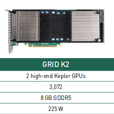
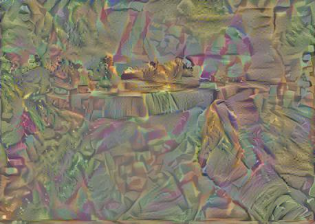
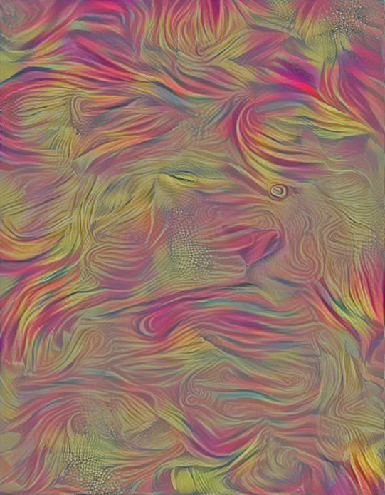

# Algoritmo neuronal de estilos artisticos

## Descripción del Trabajo
El presente trabajo se enfoca en la implementación de un algoritmo que permita la creación de imágenes artísticas de alta calidad perceptiva mediante el uso de redes neuronales profundas.

## Introducción
El ser humano ha logrado crear experiencias visuales a través del arte mediante algoritmos que han resultado un misterio por mucho tiempo. El aprendizaje profundo representa un camino para el entendimiento de este algoritmo, el uso de redes convolucionales.
En este trabajo mostramos que haciendo uso de las redes convolucionales podemos representaer el estilo y el contenido de manera separadas, así podemos generar imágenes mezclando el estilo y el contenido de dos imagenes diferentes.
## Motivo y Descarga de Responsabilidades
El contenido de una imagen y el estilo se pueden separar, así al queren combinar el contenido de una imagen con el estilo de otra no es posible encontrar una imagen que coincida completamente con ambas restricciones. Por ello para obtener imagenes visualmente atractivas podemos regular el énfasis en el contenido y estilo. Con un fuerte énfasis en el contenido se logra observar claramente la imagen pero no el estido de la otra imagen;y lo mismo ocurre al incrementar el énfasis en el contenido de la otra imagen.

## Estado del arte

### 1. Krizhevsky, A., Sutskever, I. & Hinton, G. E.  Imagenet classification with deep convolutional neural networks
####    Resumen
En el presente papers entreno un gran deep convolutional network con el objetivos de clasificar 1.2 millones de imagenes de alta resolución que fueron obtenidos del dataset de ImageNet. La red neuronal tenía 60 millones de parámetros y 5 capas convoluciones.

Para implementar el desempeño de reconocimiento de objetos podemos:
+ Recopilar un conjunto de datos más grande.
+ Aprender modelos más potentes
+ Usar tecnicas para prevenir el sobreajuste.

Las CNN tienen menos conexiones y parámetros que son más faciles de entrenar pero han tenido la desventaja de ser costosos para aplicarlo a imagénes de alta resolución.
Se obtuvieron algunas mejoras para CNN increiblementes grandes con el uso:
+ GPU's han resultado muy útiles.
+ Optimización de convolución 2D.

Imagenet consiste en imágenes de resolución variable pero el sistema planeado require de una resolución fija de 256x256 de esta manera se entrena a la red para valores RGB de pixeles.

##### Arquitectura
Nuestra red final contine 5 convoluciones y 3 capas conectadas a esta profundidad para ser importante, encontramos que eliminando cualquier capa convolucional(cada uno de los cuales contiene 1% de los parámetros del modelo) resulto inferior al final el tamaño de la red queda delimitado por la memoria disponibles en las GPU's actuales.
 + #####  ReLU Nonlinearity
Las CNN que trabajan con Relu(Rectificadores de unidades lineales) entrena varias veces más rápido que usando tanh, en donde resulta difícil conseguir resultados eficientes solo usando la neurona tradicional.
Un aprendizaje es más rápido si tiene una gran influencia en el rendimiento de modelos grandes entrenados en grandes conjuntos de datos.

+ #####  Training en multiples GPU's
Un GTX 580 GPU tiene 3gb de memoria, el cual limita el tamaño de la red. Por lo que este papers se realizá con GPU's
El esquema empleado pone la mitad de los núcleos o neuronas en cada GPU con una adicional: las GPU's se comunican solo en ciertas capas.

+ ##### Local response Normalization
Las relu tienen la propiedad que no requieren normalización de entradas para evitar la saturación. Si al menos algunos ejemplos de entrenamiento producen una entrada positiva a una relu aprenderá que pasa en esa neurona.
Sin embargo encontramos que el siguiente esquema de normalización local ayuda a la generalización.
Se aplica esta normalización despues de aplicar el ReLU en ciertas capas.
Es una normalización de brillo  reduce la tasa de error top1 en un 1. y top en 1.2
CNN logro una tasa de erroe de 13% sin normalizacion y 11% con normalización.

+ ##### Overlapping Pooling
Las capas agrupadas en CNN resumen la salida de los grupos vecinos de neuronas en mismo kernel del mapa. Tradicionalmente los vecinos por unidades adyacente de agrupaciones no se superponen.
Para ser más precisos, se puede pensar que una capa de agrupamiento consiste en una grilla de agrupamiento unidades separadas por pixeles de separación.
Generalmente observamos durante el entrenamiento que los modelos con superposición son un mas difícil de sobre equilibrar.

+ ##### Overall Architecture

   + Red tiene 8 capas con peso.
   + 3 capas completamente conectadas.
   + La salida de la ´ultima capa esta conectada a un softmax sobre 100 bias que produce una distrución sobre 1000 etiquetas de clases.
   + La 5ta capa ReLu la no linealidad se aplicada a salida de cada capa convolucional.

##### Reducing overfitting
Nuestra arquitectura tiene 60 millones de parámetros aunque las 1000 clases de ILSVRC haga que cara ejemplo imponga 10bits de restricción en la asignación de la imagen a etiquetar, esto resulta ser insuficiente para aprender tantos parámetros sin un  sobreajuste considerable.Formas de cambatir el sobreajuste.

+ ###### Data Augmentation
El método más común para reducir el sobreajuste es agradar los datos artificialmente el conjunto de datos utiliza transformaciones que preservan la etiqueta.
Empleamos 2 formas distintas de aumento de datos, los cuales permiten que las imágenes transformadas se produzcan a partir de la imagen original con muy poco cálculo, por lo que las imagenes transformadas no necesitan ser almacenadas en el disco. En la implementación las imágenes transformadas se se generan en python en la cpu mientras que el GPU entrena el lote anterior de imagenes.

  La primera forma de aumento de datos consiste en generar traducciones de imágenes y reflejos horizontales hacemos esto extrayendo 224x224 parches ( y sus reflejos horizontales) y la capacitación de nuestra red en estos parches extraidos esto incrementa el tamaño de nuestro conjunto de entrenamiento establecido en un factor de 2048 .
Sin este esquema nuestra red sufre sobreajuste sustancia que tendría que obligarnos tener redes mucho más pequeña.

  La segunda forma de aumento de datos consiste en alterar las **intensidades de canales RGB** en imagenes de entrenamiento Específicamente realizamos PCA en el conjunto de valores de pixeles RGB en el conjunto de entrenamiento.

+ ###### Dropout
La combinación de las predicciones de muchos modelos diferentes es una forma exitosa de reducir los errores de la prueba pero parece ser demasiado costoso para las redes neuronales grandes  que llevan varios días de entrenamiento.Sin embargo existe una version muy eficiente de combinación de modelos.
La técnica consiste en configurar a 0 la salida de cada neurona oculta con probabilidad 0.5. Las neuronas son dropout(abandonadas) de manera que no contribuyen al pase hacia adelante y no participan en la propagacion.
Asi cada vez que se presenta una entrada la red neuronal toma una arquitectura diferente pero todas estas arquitecturas comparten estas técnica reduce las adaptaciones complejas de las neuronas.

  Ya que cada neurona no puede confirmar en la presencia de otras neuronas se fuerza aprender caracteristicas más robustas que son utiles en la conjunción de muchos subconjuntos aleatorios diferentes de las otras neuronas.usamos dropoutup en las 2 primeras capas.

#### Detail of learning
Entrenamos nuestros modelos con una gradiente de descenso estocástio con un tamaño de lote de 128 ejemplos mometum 0,9 y decaimiento de peso 0.0005
inicializamos los pesos de cada capa con una distribución gaussianda de media cero con una desviacion estandar de 0.01 inicializamos el sesgo de las neuronas en la capa 2 4 5 capas convolucionales con las constante
esta inicialización acelera las primeras etapas de aprendizaje al proporcionar el ReLU  inicializamos las neuronas sesgos con las capas restantes a 0.

#### Discusiones
Nuestro resultados muestra  es capaz de logra buenos resultados en un conjunto de datos altamente desafiante si se elimina una sola capa 	los resultados no serán adecuados.

#### 2. Mahendran, A. & Vedaldi, A.   Understanding Deep Image Representations by Inverting them.

##### Resumen
Las representaciones de imágenes, desde SIFT y Bag of Visual Words hasta CNN, es un componente crucial  al momento de trabajar en cualquier sistema de comprensión de imágenes.
Este paper análiza la información del contenido visual  de la representación.
Para ello se preguntan cual es la medida posible para reconstruir la imagen en si, en cual trabajan con métodos para invertir las representaciones usando HOG y CNN.

Se busca hacer un análisis directo de la representación haciendo una caracterización de la información de la imágen.

que reconstruye la imagen desde el código.

* Se usará los metodos SIFT, HOG y  CNN, usando solo la informacion que se obtiene de la representación de la imagen.
* Luego aplicarán su propio metodo para comprobar que obtienen mejores resultados que HOG.
* Aplicarán la tecnica de inversión al análisis del CNN, donde exploran la invarianza de la muestra al obtener  reconstrucciones aproximadas.
* Estudiaran la localidad de la información almacenada en la representación mediante la reconstrucción de las imágenes seleccionadas en grupos de neuronas sea por espacio o canal.

#### 3. Karayev, S. et al. Recognizing image style. arXiv preprint arXiv:1311.3715 (2013)

### 1.1 Resumen

Aqui se describe un enfoque para predecir el estilo de las imágenes y se realizo una evaluación exhaustiva de las diferentes características de la imagen para estas tareas. Se encontro que las características aprendidas en una red multicapa generalmente tienen un mejor rendimiento. Se uso un conjunto de datos existente de calificaciones estéticas y anotaciones de estilo fotográfico. Se presento dos conjuntos de datos novedosos: fotografías de 80K de Flickr anotadas con 20 etiquetas de estilos definidos y 85K pinturas anotadas con 25 etiquetas de estilo o género. Tambien se utiliza los clasificadores aprendidos para extender la búsqueda de imágenes tradicional basada en etiquetas para tener en cuenta las restricciones estilísticas y demostrar la comprensión del estilo de los conjuntos en diferentes datos.

### Introducción
Las imágenes creadas deliberadamente transmiten significado, y el estilo visual a menudo es un componente significativo del significado de la imagen.

Aunque es muy reconocible para los observadores humanos, el estilo visual es un concepto difícil de definir rigurosamente. Ha habido algunas investigaciones previas en el estilo de la imagen, pero esto se ha limitado principalmente al reconocimiento de algunas propiedades ópticas bien definidas, como la profundidad de campo. Definimos varios tipos diferentes de estilos de imagen y recopilamos un nuevo conjunto de datos a gran escala con fotografías anotadas con etiquetas de estilo. Este conjunto de datos incorpora varios aspectos diferentes del estilo visual, incluidas las técnicas fotográficas ("Macro", "HDR") y los estilos de composición ("Mínimo", "Geométrico"), estados de ánimo ("Sereno", "Melancolía"), géneros ("Vintage", "Romantico", "Horror") y tipos de escenas ("Misty", "Sunny")). Estos estilos no son mutuamente excluyentes y representan diferentes atributos de estilo. También reunimos un gran conjunto de imágenes visuales (en su mayoría pinturas) anotadas con etiquetas de arte de estilo histórico, que van desde el Renacimiento hasta el arte moderno.

Se descubre que las características de la red neuronal convolucional profunda (CNN) funcionan mejor para la tarea. Esto es sorprendente por varias razones: estas características fueron entrenadas en categorías de clases de objetos (ImageNet), y muchos estilos parecen ser principalmente sobre opciones de color, sin embargo, CNN presenta funciones de histograma de color pulsante. Esto lleva a una conclusión de nuestro trabajo: las características de nivel medio derivadas de los conjuntos de datos de objetos son genéricas para el reconocimiento de estilo y superiores a las funciones ajustadas a mano.

### Aplicaciones y código

Se ve primero un ejemplo de uso del método para buscar imágenes por estilo. En la misma línea, los resultados de búsqueda de similitud visual podrían filtrarse por estilo visual, posibilitando consultas como mas similar a esta imagen. En segundo lugar, las etiquetas de estilo pueden proporcionar valiosas características de nivel medio para otras tareas de comprensión de imágenes. Por ejemplo, cada vez se realizan más esfuerzos para comprender el significado de la imagen, la estética, el interés, la popularidad y la emoción, y el estilo es una parte importante del significado. Finalmente, los predictores aprendidos podrían ser un componente útil para modificar el estilo de una imagen.

### Trabajo relacionado

La mayoría de las investigaciones en visión artificial abordan el reconocimiento y la reconstrucción, independientemente del estilo de la imagen. Algunas obras anteriores se han centrado directamente en la composición de imágenes, particularmente en los atributos de alto nivel de belleza, interés y memorabilidad. Más comúnmente, varios autores anteriores han descrito métodos para predecir la calidad estética de las fotografías. Datta, diseñó las características visuales para representar conceptos tales como el colorido, la saturación, la regla de los tercios y la profundidad de campo, y evaluó las predicciones de calificación estética en fotografías.

En uno de los trabajos se introdujo el conjunto de datos de Análisis visual estético (AVA), anotado con calificaciones de los usuarios de DPChallenge, un sitio web de competencia de habilidades fotográficas. El conjunto de datos de AVA contiene algunas etiquetas de estilo fotográfico, derivadas de los títulos y las descripciones de los desafíos fotográficos a los que se enviaron las fotografías. Los atributos que encontraron para ser informativos (por ejemplo, "foto hermosa", "buen detalle") no son específicos del estilo de la imagen.

### Fuentes de datos

Se quiere estudiar una gama más amplia de estilos, incluidos diferentes tipos de estilos que van desde géneros, estilos de composición y estados de ánimo. Además, se necesitan grandes conjuntos de datos para obtener resultados efectivos, por lo que nos gustaría obtener datos de comunidades en línea, como Flickr.

Estilo Flickr. Aunque los usuarios de Flickr suelen proporcionar etiquetas de forma libre para sus imágenes cargadas, las etiquetas tienden a ser bastante poco fiables. En cambio, recurrimos a los grupos de Flickr, que son colecciones de conceptos visuales comisariadas por la comunidad. Contiene más de 167K de imágenes en el momento de la escritura; el grupo "Film Noir Mood" se describe como "No solo fotografía en blanco y negro, sino también oscura, arenosa, cambiante ..." y comprende más de 7,000 imágenes.

Wikipaintings. También proporcionamos un nuevo conjunto de datos para clasificar el estilo de pintura. Recopilamos un conjunto de datos de 100.000 imágenes de alto arte, en su mayoría pinturas, etiquetadas con el artista, estilo, género, fecha e información de etiqueta libremente por una comunidad de expertos en el sitio web Wikipaintings.org. Nuestro conjunto de datos presenta una diversidad estilística importante, que abarca principalmente los estilos del Renacimiento a los movimientos del arte moderno (la Figura 6 proporciona más desgloses). Seleccionamos 25 estilos con más de 1,000 ejemplos, para un total de 85,000 imágenes.

### Algoritmo de aprendizaje

Debido a que los conjuntos de datos que manejamos son bastante grandes y algunas de las características son de gran dimensión, consideramos solo clasificadores lineales, confiando en funciones sofisticadas para proporcionar robustez. Usamos una implementación de código abierto de Stochastic Gradual Descent con subgradiente adaptativo. El proceso de aprendizaje optimiza la función dada en el paper.

## Métodos
Los resultados de los investigadores Leon A. Gatys, Alexander S. Ecker,  Matthias Bethge fueron realizados en base al uso de una red VGG network, la cual es una convolutional neural network que ha sido entrenada con aproximandamente 1.2 millones de imagenes del dataset [ImageNet](http://image-net.org/index) por el Visual Geometry Group de la Universidad de Oxford.
El VGG-19 se encuentra disponible en muchas heramientas como caffe, keras, matlab, etc.

En el trabajo se usaron 16 capas convolucionales, 5 capas de agrupamiento de 19 capas VGG.

Cada capa en la red define a non-linear filter cuya complejidad aumenta con la posición de las capas de red.
Para visualizar que esta codificada en las diferentes capas de jerarquía. Desarrollamos una gradiente de descenso en una white noise image.

Error cuadratíco entre las 2 características

 - **p :**  imagen orginal
 - **x :**  imagen generada
 - **l :**  capa actual
 - **Flij :** función de activación del i-esimo filtro en la posición j de la capa l.
 - **Plij :** función de activación de la imagen generada.

Al derivar la función de perdida con respecto a la activación en la capa l.

- **Fl :** respresentación de característica de x en la capa l.
- **Pl :** imagen generada de característica de p en la capa l.

Apartir de la cual podemos calcular la gradiente con respecto  a la imagen utilizando el error estandar back-propagation. Con lo cual podemos cambiar la imagen aleatoria hasta que genere un respuesta en un capa de la CNN como la imagen original p.

Donde Fl es un matriz en RNlxMl
- **Nl:** Número de filtros distintos
- **Ml:** tamaño del mapa de características

Producto interno entre el mapa de carácteristicas vectorizado i y j en la capa l.

-  **El :** contribución de la capa a la perdida total.
-  **Lstyle :** Perdida total

Para Generar la mezcla de las imágenes
La función de perdida que minimizamos es:

## Proceso

## Esquema del proceso

- Reconstrucción del Contenido

- Reconstrucción del estilo

- Redes Neuronales Convolucionales

- Arquitectura de la Red VGG

## Herramientas
Hay varias herramientas que se pueden emplear ya que nos facilitan la implementación de los algoritmos de Aprendizaje Profundo y algunas de ellas son las sgtes:

- Torch7

- Theano - Pylearn2

- Caffe

- [TensorFlow](https://github.com/TeamFives/NeuralArtisticStyle/blob/master/Cuaderno/NeuralArtisticStyle.ipynb)

## Características del Servidor
Especificaciones de tarjeta gráfica NVIDIA GRiD K2

Uso de la Tarjeta gráfica

##Resultados

##Primera

###Imagen que da el estilo

###Imagen con contenido

###Proceso Iteración 1999

###Proceso Iteración 3999

###Proceso Iteración 5999

###Proceso Iteración 7999

###Imagen de resultado

##Segundo

###Imagen que da el estilo

###Imagen con contenido

###Proceso Iteración 4999

###Proceso Iteración 10999

###Proceso Iteración 16999

###Proceso Iteración 22999

###Proceso Iteración 28999

###Imagen de resultado

## Conclusiones
- Reemplazar la operación max-pooling por agrupación promedio mejora el flujo de gradiente y se obtiene resultados ligeramente más atractivos.
- Las representaciones de contenido y estilo en la Red Neural Convolucional son separables.
- Las imágenes visualmente más atractivas suelen ser creadas en las capas más altas de la red.
